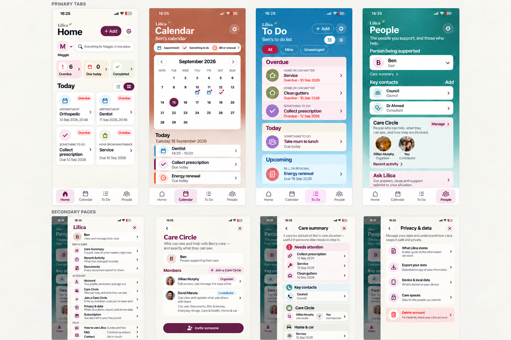
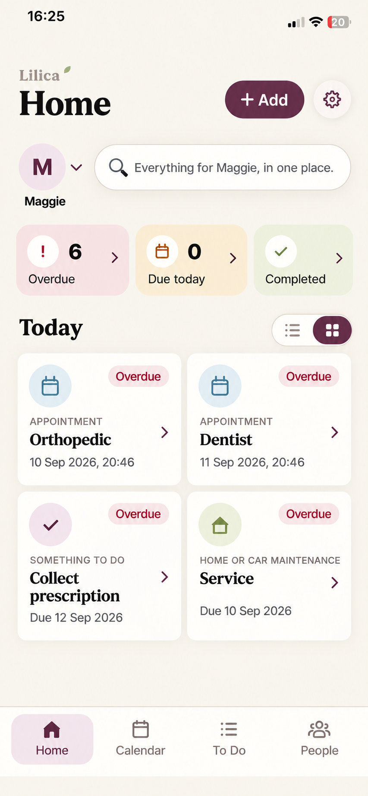
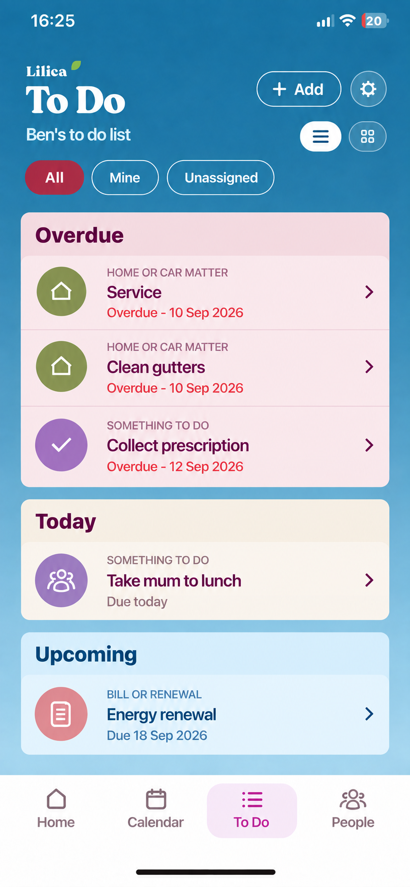
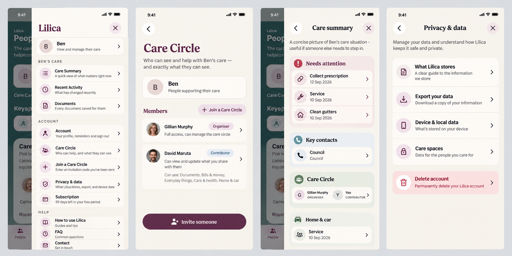

# Phase 22 - Approved Visual Direction And Controlled Implementation Plan

**Status: VISUAL DIRECTION APPROVED BY THE PRODUCT OWNER AFTER STEP-BY-STEP REVIEW. IMPLEMENTATION IS NOT YET AUTHORISED. GPT and the product owner must review this report and issue a separate implementation prompt before any application code, theme, dependency or component is changed.**

Date: 15 September 2026

Repository baseline reviewed: branch `prephase22-remove-supported-person-faq-help`, commit `dd7cf6a`

Companion audit: `docs/PHASE_22_VISUAL_AUDIT.md`

The image is a visual-direction reference, not a pixel specification and not a source of product copy. Generated names, dates, portraits and small text are illustrative. The current app, its approved wording, domain model, permissions, routes and behaviour remain authoritative. Where an image and this written contract differ, this written contract and the existing product contract govern.

## 1. How This Direction Was Reached

This was not a one-shot redesign produced without product-owner involvement. The product owner and Codex worked through the direction together, one decision at a time, using current-device screenshots from `C:\Users\DavidPC\Downloads\visualPolish`, the existing Phase 22 audit, a BBC editorial interface reference and several generated Lilica mock iterations.

The review sequence was:

1. The current four-tab app and the Phase 22 audit were reviewed against the real screenshots.
2. A BBC-inspired To Do concept established the desired increase in hierarchy, confidence and finish. The intention was to borrow editorial discipline, not BBC branding or a dark visual theme.
3. To Do tiles were progressively lightened. Uniformly dark tiles were rejected as inconsistent with Lilica and too visually heavy.
4. A bright blue background was tested and rejected as too flashy. A calmer matte mineral blue was preferred.
5. Section-specific record colours were explored. The first dark plum Overdue treatment was rejected as muddy and medicinal.
6. Overdue was changed to a pale smoked-rose surface with aubergine text and restrained berry status treatment. This was accepted as the correct direction.
7. A top-to-bottom To Do gradient was added to relate To Do to Calendar and People. The first attempt was too subtle. The next attempt made the top too dark and was rejected. The accepted construction keeps the approved medium matte blue at the top and creates the visible transition by lightening the lower portion only.
8. The product owner identified a dynamic-content contrast defect before implementation: additional Overdue records could push Today and Upcoming headings into the pale part of the gradient. The accepted solution makes every status section own its contrast surface and heading, so readability never depends on vertical position.
9. Home and To Do list/grid view toggles were explored. Home's two-column icon-led grid direction was accepted. To Do's first literal grouped grid exposed awkward empty cells and cramped text, so the toggle requirement is approved but its final grid composition remains a controlled implementation/mock checkpoint rather than permission to ship the weak first attempt.
10. The four primary tabs were reviewed side by side. They were accepted as distinct destinations belonging to one product, with expressive colour reserved for these main areas.
11. Current secondary pages and the Settings drawer were reviewed. The product owner explicitly rejected making secondary pages colourful. A quiet warm-neutral interior system and a compact, single-header drawer system were mocked and approved as the theme to apply across all active secondary pages.
12. A more compact typography direction was requested. The first generated attempt did not change the serif page titles enough and was explicitly rejected as inadequate. A second pass using compact humanist sans headings, with serif retained only for the Lilica wordmark, was accepted.
13. The product owner confirmed that compact typography must not mean materially smaller text. The approved method is narrower letterforms, controlled weights, zero tracking and tighter but comfortable line height, while retaining readable body sizes and accessibility.
14. The coherent bottom-navigation icon treatment visible in the accepted mocks was explicitly called out and added to this approved plan.

This history matters. Implementation must not reopen rejected directions or treat the final board as an arbitrary agent preference.

## 2. Approved Product-Level Visual Model

Lilica has two related visual modes.

### 2.1 Primary destinations

Home, Calendar, To Do and People are the expressive front of the product. Each may have its own recognisable colour identity, while sharing typography, spacing, controls, icon language and bottom navigation.

### 2.2 Secondary working pages

Record details, editors, collections, care administration, account, privacy, subscription and help are a quiet working environment. They use warm neutral grounds and restrained semantic accents. They must feel like Lilica without copying the coloured backgrounds of the four main tabs.

Premium quality must come from composition, information hierarchy, typography, alignment, interaction and finish. It must not come from adding decoration, gradients to every page, excessive cards, oversized radii or animation for its own sake.

## 3. Approved Four-Tab Direction

### 3.1 Home

- Preserve the existing information architecture: supported-person context and switcher, search entry, status summary, Today records, Add, Settings and bottom navigation.
- Use the warm light Home canvas. Home remains the quietest of the four tabs.
- Preserve clear tonal summary surfaces for Overdue, Due today and Completed.
- Support list and two-column grid display modes for the record area.
- In grid mode, recompose information for the available width. Do not merely shrink a list row. Preserve category, title, date/status and the record affordance.
- Keep list as the initial/default presentation unless existing persisted product behaviour says otherwise. Remember the user's display preference once the preference-storage approach is approved.

Detailed grid reference:

### 3.2 Calendar

- Preserve the approved month grid, selected-day behaviour, event projection and agenda.
- Keep the terracotta-to-pale vertical background treatment.
- Preserve the white month surface and compact event rows.
- Improve fit, typography and icon consistency without changing date logic, filters, selected-day state or record-opening behaviour.

### 3.3 To Do

- Replace the current sage/olive direction with the accepted calm matte mineral-blue identity.
- The upper background is a medium matte mineral blue, not navy and not bright cyan.
- The background becomes visibly lighter toward the bottom by lightening the lower portion, not by darkening the top.
- The gradient is atmospheric only. No readable heading may depend on where it lands within the gradient.
- Overdue, Today and Upcoming each own a contrast-controlled section surface with the section heading inside it.
- Overdue uses pale smoked rose, deep aubergine headings/titles and restrained berry/red status emphasis.
- Today uses warm ivory with dark plum text.
- Upcoming uses pale mineral blue with deep blue text.
- In list mode, records are clean internal rows with spacing and subtle separators. Do not place multiple rounded record cards inside a larger rounded section card.
- Preserve All, Mine and Unassigned filters, assignments, completion behaviour, grouping rules and record-opening behaviour exactly.
- Add a list/grid display toggle. The functional requirement and control are approved. The weak first grouped-grid mock is not approved for implementation because odd group counts produced dead space and cramped text. A final To Do grid composition must be reviewed at the relevant batch checkpoint before release.

Detailed section reference:

### 3.4 People

- Preserve the supported-person selector, Care summary, Key contacts, Care Circle, Recent activity and Ask Lilica information architecture.
- Keep the teal-to-light vertical identity and the existing principle that important groups own readable surfaces.
- Improve fit for real names, roles and longer content without shrinking text to preserve rigid card geometry.
- Preserve permissions, person switching and every existing route.

## 4. Approved View Toggles

### 4.1 Shared behaviour

- Home and To Do receive a compact two-state list/grid segmented control using familiar icons, not text labels.
- The control changes presentation only. It must never change filtering, sorting, grouping truth, selected person, assignment, completion state or record data.
- Both states expose the same records and actions.
- The selected state uses Lilica plum or an appropriate high-contrast treatment; the inactive state is quiet.
- Each control must expose an accessibility role, a clear label such as `Show list` or `Show grid`, and selected-state information.
- Touch targets remain at least 44 by 44 logical pixels even when the visible control is compact.
- Preference persistence must be account-scoped if persisted. It must never leak from one authenticated user to another.

### 4.2 Home placement

The Home toggle belongs beside the record-area heading because it changes only that record presentation, not the summary strip or supported-person/search controls.

### 4.3 To Do placement

The To Do toggle is global to the page and belongs beside the `Ben's to do list`-style subtitle or equivalent current person-scoped label. It remains visually separate from All/Mine/Unassigned, which are data filters rather than display controls.

## 5. Approved Typography

- Retain the distinctive serif treatment only for the small Lilica wordmark.
- Use a compact premium humanist sans for page titles, section headings, record titles, controls and body copy.
- The accepted visual direction resembles Inter Tight for headings and Inter for body, or a metrically equivalent accessible family. The exact packaged font and licence must be confirmed before dependency changes.
- Do not reduce current readable body text merely to fit layouts. Current 16px-class body copy, 14px-class supporting copy and 13px-class metadata are a minimum reference, subject to real font metrics and accessibility testing.
- Achieve compactness through narrower glyphs, sensible semibold/bold weights, zero letter spacing and controlled line height.
- Do not use negative tracking.
- Avoid excessively heavy black weights, narrow condensed display faces and a generic platform-default appearance that differs across Android and iOS.
- Large text settings must reflow rather than clip, overlap or silently truncate essential information.

## 6. Approved Bottom Navigation

- Preserve exactly four destinations and their current order: Home, Calendar, To Do, People.
- Use one coherent, familiar line-icon family: home, calendar, list/tasks and people.
- Keep the visible text label under every icon. Icons do not replace labels.
- Selected state uses the approved pale plum surface with plum icon and label.
- Inactive icons and labels use a quiet warm neutral.
- Use consistent stroke weight, optical size and baseline alignment across all four icons.
- Preserve safe-area handling, navigation state, routes and touch targets.
- Do not add badges, new destinations, gesture navigation or a floating action button through this work.
- The implementation plan may propose `lucide-react-native` as the coherent icon source, but no new dependency is authorised by this report alone. GPT and product-owner approval of the implementation prompt is required first.

## 7. Approved Secondary-Page Theme

The approved layout reference is:

The final compact-sans typography in the overview board supersedes serif headings that remain in this earlier detailed layout mock.

### 7.1 Shared shell

- Warm soft ivory or off-white canvas.
- No colourful full-page backgrounds and no decorative page gradients.
- One header owner per surface.
- Back on the left, concise title, and only the essential contextual action on the right.
- Editorial clarity through compact sans titles, alignment and spacing rather than oversized hero composition.
- Plum primary actions and links.
- Colour limited to category icons, status meaning, selected state and restrained tonal information groups.
- Fine dividers, modest 6-8px radii and almost no shadow.
- Scrolling, keyboard handling and safe areas must be owned once.

### 7.2 Reusable secondary patterns

1. **Record detail:** category icon, strong title, status/date summary, semantic information sections and one clear Edit action. The same record-detail component is used regardless of whether entry came from Home, Calendar, To Do, Search or a person projection.
2. **Record editor:** calm form rhythm, consistent fields, progressive disclosure for optional content and a keyboard-aware Save action.
3. **Collections:** Documents, Contacts, Recent Activity, Search and similar lists share clear metadata, separators, useful empty states and consistent row actions.
4. **Care and membership:** Care Circle, invitations, care summary and manage-care pages use profile-led context, scannable roles/permissions and clearly separated irreversible actions.
5. **Account and settings:** flat rows, real switch controls for binary preferences, restrained accordions and a clear separation between routine settings and danger actions.
6. **System states:** one polished family for loading, empty, success and recoverable error states, with an optional relevant action. A bare spinner or isolated raw error string is not the approved finish.

### 7.3 Continuity from a primary tab

- Carry forward the same record title, category icon and semantic status.
- Use a restrained category accent rather than the originating tab's full background colour.
- Preserve view-before-edit and every current dismissal/back behaviour.
- Use subtle press and state transitions only where they improve comprehension.
- Do not add decorative entry animations to every screen or card.

## 8. Approved Settings Drawer

- Retain one shared right-hand drawer across all four tabs at approximately the current 88 percent phone width and capped tablet width.
- Preserve the dimmed underlying tab so the drawer retains spatial context.
- Use a warm neutral drawer canvas.
- Use one compact root header with Lilica/Settings context and a familiar X close icon.
- Show the current supported-person context near the top where relevant.
- Preserve current groups and real destinations: `[Name]'s care`, Account and Help, including role-gated and availability-gated rows exactly as the current app does.
- Present the root menu as compact flat rows with small meaningful icon discs, short descriptions where useful and subtle separators. Do not return to a tall stack of floating cards.
- The menu remains scrollable. Do not shrink text to force all destinations onto one viewport.
- Drawer subsections use one header layer only: Back, subsection title and Close. Remove the visual duplication of a Close bar followed by a second Back/header/title stack, without changing navigation behaviour.
- Back returns to the drawer root. Close or backdrop dismissal returns to the unchanged underlying tab. Preserve this tested distinction.
- Routine, account and help actions retain their existing grouping. Sign-out/destructive actions are separated and danger colour is reserved for genuinely destructive outcomes.

## 9. Explicitly Protected Behaviour

Phase 22 implementation is visual and responsive only. It must not change or delete:

- Authentication, verification, recovery, onboarding or account-scoped state isolation.
- Supported-person creation, selection, switching or care-space ownership.
- Record types, IDs, storage, cloud sync, outbox/conflict logic, occurrences or recurrence semantics.
- Date/time wheel behaviour or date-only/local-time semantics.
- Assignments, filters, completion transitions, reminders or notification truth.
- Care Circle invitations, multi-person invitation groups, role/domain permissions, rate limiting or membership logic.
- Subscription entitlement, read-only gating, RevenueCat integration or server enforcement.
- Data export, account deletion, archive, handoff, leave or permanent-removal behaviour.
- Current approved copy, unless the implementation prompt separately names exact copy changes.
- Route destinations, Back/Close semantics, tab order or entry points.
- Welcome/onboarding architecture and previously approved Phase 1 behaviour.
- Existing accessibility roles, labels and states.
- Any active screen, feature, migration, test, document or data.

No database migration, Supabase policy/RPC change, Edge Function change, environment change, EAS build, OTA release, dependency upgrade or production deployment is part of this visual direction.

## 10. Regression-Control Contract

No engineering process can honestly promise that a defect is mathematically impossible. This plan instead makes **zero accepted functional regression** a release condition and defines controls strong enough to detect and contain mistakes before approval.

For every implementation batch, the implementing agent must:

1. Record the starting commit and complete `git status` before editing.
2. Read the active component, its tests, route wiring and relevant architecture docs before changing it.
3. Produce a file-level scope list and a protected-behaviour checklist.
4. Add or update focused regression tests before or alongside shared-shell, navigation, state or persistence changes.
5. Keep visual props/state separate from domain and persistence logic. A view toggle must be pure presentation state.
6. Make no deletion, rename, route replacement, schema change, copy rewrite, dependency upgrade or unrelated refactor unless a later approved prompt explicitly authorises it.
7. Run focused tests after each component family, not only at the end.
8. Run `npm run validate` on every visual batch. Run `npm run validate:all` only if an explicitly approved future batch changes database work; this plan proposes none.
9. Run `git diff --check`, secrets scanning and a complete final diff/status review.
10. Verify that the diff contains only the approved batch. Unrelated user or agent changes must not be staged, reverted or rewritten.
11. Physically test Android and iPhone at normal text size, a smaller-height viewport and increased text size. Keyboard-owning screens require keyboard-open QA.
12. Test every touched entry and exit path, including system Back, visible Back, drawer Close, backdrop dismissal and tab preservation.
13. Compare screenshots with the approved visual references and check text fit, safe-area clearance, contrast and scroll reachability.
14. Report exact changes, commands/results, device coverage, limitations and open decisions.
15. Stop after the batch. Do not begin the next batch without product-owner approval.

If a batch changes functional behaviour, loses content, breaks navigation, introduces clipping/overlap, fails validation or cannot be verified, it is not complete and must not be presented for approval. The agent must stop, explain the conflict and revert or repair only its own batch without disturbing pre-existing work.

## 11. Proposed Controlled Implementation Batches

### Batch 0 - Authority, baseline and screenshot harness

- Confirm GPT/product-owner approval and the exact branch/commit.
- Reconcile any changes made after this report.
- Capture baseline screenshots for primary tabs, drawer and representative secondary pages.
- Map existing tests and add only missing high-value navigation/layout assertions.
- No visual change in this batch.

### Batch 1 - Typography, icons and low-level tokens

- Package the approved compact sans family locally after licence/dependency approval.
- Preserve Fraunces only for the Lilica wordmark.
- Add the coherent navigation/utility icon source after explicit dependency approval.
- Define typography and icon roles without migrating every screen at once.
- Prove font loading, fallback, large-text behaviour and Android/iOS consistency.
- Stop for visual approval before broad adoption.

### Batch 2 - Shared primary shell and bottom navigation

- Implement the approved bottom-navigation icons and selected/inactive treatments.
- Establish shared compact header-action sizing and the quieter Settings control.
- Preserve all tab routes and state.
- Validate all four tabs before proceeding.

### Batch 3 - Home and Calendar

- Apply approved typography/fit refinements.
- Add Home list/grid display state and account-scoped preference only if separately approved in the implementation prompt.
- Preserve Home information architecture and Calendar logic exactly.
- Validate dense records, long names/dates, small heights and increased text.

### Batch 4 - To Do

- Apply approved matte mineral-blue gradient and surfaced status sections.
- Preserve all filters, grouping and canonical completion behaviour.
- Add the display toggle.
- Produce and approve the final To Do grid state before treating grid mode as complete.
- Stress-test many Overdue records so Today/Upcoming contrast never depends on page position.

### Batch 5 - People

- Apply the approved primary typography/icon system while preserving the accepted information architecture and gradient.
- Fix text fit through responsive composition, not smaller text.
- Validate person switching, Care Circle entry, long names/roles and bottom clearance.

### Batch 6 - Drawer shell and root menu

- Apply the approved neutral drawer root, compact flat rows and icon treatment.
- Introduce one drawer-content shell that owns safe areas, Back/title/Close and scrolling once.
- Preserve role/availability gating and every tested Back/Close outcome.
- Validate the longest real menu and increased text.

### Batch 7 - Representative secondary patterns

- Migrate one screen from each secondary family first: record detail/editor, collection, care/membership, account/privacy and shared state.
- Review screenshots and behaviour before expanding the pattern.
- Do not bulk-rewrite all secondary screens in one commit.

### Batch 8 - Remaining active secondary pages

- Apply only approved, proven patterns to the remaining active screens.
- Exclude dormant legacy screens unless their production status is separately confirmed.
- Preserve all existing product copy and actions.

### Batch 9 - Whole-app regression and physical acceptance

- Run complete automated validation and full diff review.
- Perform end-to-end physical QA across both platforms, normal/increased text and keyboard paths.
- Compare all primary and representative secondary screenshots with the approved board.
- Correct visual defects only. Do not use this pass to add features or refactor unrelated code.
- Produce a final implementation report and stop for product-owner acceptance.

## 12. Required Acceptance Evidence

Each batch report must include:

- Starting and ending commit/status.
- Exact files changed and why.
- Focused and full validation results.
- Confirmation that no schema, permissions, domain behaviour, routes or copy changed.
- Before/after screenshots for every touched screen family.
- Android and iPhone device/viewport coverage.
- Increased-text and keyboard results where relevant.
- Known limitations and unresolved decisions.
- A complete diff classification showing no unrelated work or secret material.

## 13. Decisions Still Requiring Implementation-Prompt Precision

The visual direction is approved, but a future implementation prompt should explicitly settle:

- The exact compact sans package and licence.
- The icon package/dependency approach, proposed as Lucide where technically compatible.
- Whether Home/To Do view preference persists immediately or begins session-local for the first batch.
- The final To Do grid arrangement, because the first grouped-grid mock was intentionally not accepted.
- Exact batch boundaries and physical-device approval gates.

These are not permission for an implementation agent to choose silently.

## 14. Current Gate

The product owner has approved the look-and-feel direction recorded here after collaborative, iterative review. GPT review is next. **No Phase 22 implementation work may begin until the product owner issues a separate explicit implementation prompt after that review.**
